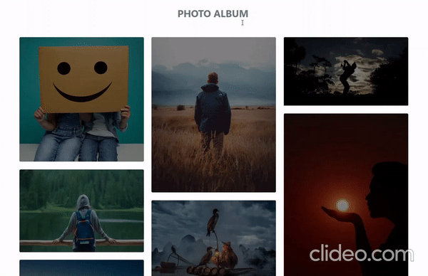

# NgxPhotoGallery

## Angular Image Gallery

[![NPM version][npm-image]][npm-url]
[](http://opensource.org/licenses/MIT)
[]()

## Getting started

#### Step 1: Install [ng-bootstrap](https://ng-bootstrap.github.io/#/getting-started)

```bash
   ng add @ng-bootstrap/ng-bootstrap
```

#### Step 2: Install ngx-nic-parser

```bash
    npm install ngx-photo-gallery --save
```

## Example usage:
Add the NgxPhotoGalleryModule to the imports of the module.
```js
      import {NgxPhotoGalleryModule} from "ngx-photo-gallery";

      @NgModule({
        imports: [
          NgxPhotoGalleryModule
        ]
      })
```

Add the element to your HTML:
```html

<ngx-photo-gallery
  [images]="gallery"
  [albumTitle]="'Photo Album'"
  [brightness]="'0.5'"
  [searchImageBase64]="'data:image/svg+xml;base64,PD94bWwgdmVyc2lvbj0iMS4wIiA/PjxzdmcgaGVpZ2h0PSIzMnB4IiB2ZXJzaW9uPSIxLjEiIHZpZXdCb3g9IjAgMCAzMiAzMiIgd2lkdGg9IjMycHgiIHhtbG5zPSJodHRwOi8vd3d3LnczLm9yZy8yMDAwL3N2ZyIgeG1sbnM6c2tldGNoPSJodHRwOi8vd3d3LmJvaGVtaWFuY29kaW5nLmNvbS9za2V0Y2gvbnMiIHhtbG5zOnhsaW5rPSJodHRwOi8vd3d3LnczLm9yZy8xOTk5L3hsaW5rIj48dGl0bGUvPjxkZXNjLz48ZGVmcy8+PGcgZmlsbD0ibm9uZSIgZmlsbC1ydWxlPSJldmVub2RkIiBpZD0iUGFnZS0xIiBzdHJva2U9Im5vbmUiIHN0cm9rZS13aWR0aD0iMSI+PGcgZmlsbD0iIzkyOTI5MiIgaWQ9Imljb24tMTExLXNlYXJjaCI+PHBhdGggZD0iTTE5LjQyNzExNjQsMjEuNDI3MTE2NCBDMTguMDM3MjQ5NSwyMi40MTc0ODAzIDE2LjMzNjY1MjIsMjMgMTQuNSwyMyBDOS44MDU1NzkzOSwyMyA2LDE5LjE5NDQyMDYgNiwxNC41IEM2LDkuODA1NTc5MzkgOS44MDU1NzkzOSw2IDE0LjUsNiBDMTkuMTk0NDIwNiw2IDIzLDkuODA1NTc5MzkgMjMsMTQuNSBDMjMsMTYuMzM2NjUyMiAyMi40MTc0ODAzLDE4LjAzNzI0OTUgMjEuNDI3MTE2NCwxOS40MjcxMTY0IEwyNy4wMTE5MTc2LDI1LjAxMTkxNzYgQzI3LjU2MjExODYsMjUuNTYyMTE4NiAyNy41NTc1MzEzLDI2LjQ0MjQ2ODcgMjcuMDExNzE4NSwyNi45ODgyODE1IEwyNi45ODgyODE1LDI3LjAxMTcxODUgQzI2LjQ0Mzg2NDgsMjcuNTU2MTM1MiAyNS41NTc2MjA0LDI3LjU1NzYyMDQgMjUuMDExOTE3NiwyNy4wMTE5MTc2IEwxOS40MjcxMTY0LDIxLjQyNzExNjQgTDE5LjQyNzExNjQsMjEuNDI3MTE2NCBaIE0xNC41LDIxIEMxOC4wODk4NTExLDIxIDIxLDE4LjA4OTg1MTEgMjEsMTQuNSBDMjEsMTAuOTEwMTQ4OSAxOC4wODk4NTExLDggMTQuNSw4IEMxMC45MTAxNDg5LDggOCwxMC45MTAxNDg5IDgsMTQuNSBDOCwxOC4wODk4NTExIDEwLjkxMDE0ODksMjEgMTQuNSwyMSBMMTQuNSwyMSBaIiBpZD0ic2VhcmNoIi8+PC9nPjwvZz48L3N2Zz4='"
  [searchAlt]="'Search Image'"
></ngx-photo-gallery>


```

And add this to your ts file:
```js

export class AppComponent {
  gallery = [
    {
      type: 'photo',
      url: 'https://d3nn873nee648n.cloudfront.net/HomeImages/Concept-and-Ideas.jpg'
    },
    {
      type: 'photo',
      url: 'https://images.pexels.com/photos/1172253/pexels-photo-1172253.jpeg?auto=compress&cs=tinysrgb&dpr=1&w=500'
    },
    {
      type: 'photo',
      url: 'https://loveshayariimages.in/wp-content/uploads/2022/05/New-Sad-Alone-Whatsapp-DP-Profile-Images-pics-free-download.jpg'
    },
    {
      type: 'photo',
      url: 'https://www.bhaktiphotos.com/wp-content/uploads/2018/04/Hindu-Shiva-God-Wallpaper-Free-Download.jpg'
    }
  ]
}

```
### Output


## Inputs
| Name                    | Type      | Default      | Description                                                                                                                                                                                                                          |
|-------------------------|---------- | ------------ |--------------------------------------------------------------------------------------------------------------------------------------------------------------------------------------------------------------------------------------|
| `images`     | string |        null      | Images array                                                                                                                                                                                                |
| `albumTitle`             | string|       null       | Gallery name.                                                                                                                                                                                                          |
| `brightness`              | string    |     null         | brightness of the image when hover. |
| `searchImageBase64`                | string    |   null        | search icon base64.                                                                                                         |
| `searchAlt`           | string    |   null    | Images alt.                                                                                                                                                                |

[npm-url]: https://www.npmjs.com/package/ngx-nic-parser
[npm-image]: https://img.shields.io/npm/v/ngx-nic-parser?style=flat-square
